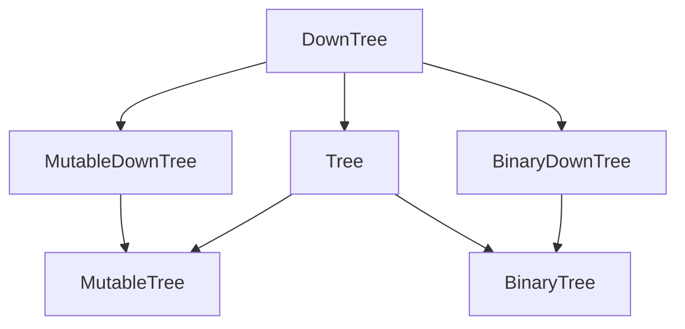

This Python package contains a few abstract base classes for tree data structures.
Trees are very common data structure that represents a hierarchy of common nodes.
There are many different ways to represent them.
This package tries to provide a uniform interface, mixin methods and some utility functions without settling on a concrete tree implementation.

## Abstract base classes ##

```python
from abstracttree import DownTree, to_mermaid

to_mermaid(DownTree)
```



A `Downtree` needs to have links to its direct children, but doesn't require a link to its parent.
A `Tree` needs to have links to both its `children` and its `parent`.

| ABC               | Inherits from             | Abstract Methods                | Mixin Methods                                                                                                                                                           |
|-------------------|---------------------------|---------------------------------|-------------------------------------------------------------------------------------------------------------------------------------------------------------------------|
| `DownTree`        |                           | `children`                      | `nodes`, `nodes.preorder()`, `nodes.postorder()`, `nodes.levelorder()`, `descendants`, `leaves`, `levels`, `levels.zigzag()`, `is_leaf`, `transform()`,  `nid`, `eqv()` |
| `Tree`            | `DownTree`                | `parent`                        | `root`, `is_root`, `ancestors`, `path`, `siblings`                                                                                                                      |
| `MutableDownTree` | `DownTree`                | `add_child()`, `remove_child()` | `add_children()`                                                                                                                                                        |
| `MutableTree`     | `Tree`, `MutableDownTree` |                                 | `detach()`                                                                                                                                                              |
| `BinaryDownTree`  | `DownTree`                | `left_child`, `right_child`     | `children`, `nodes.inorder()`, `descendants.inorder()`                                                                                                                  |
| `BinaryTree`      | `BinaryDownTree`, `Tree`  |                                 |                                                                                                                                                                         |

In your own code, you can inherit from these trees.
For example, if your tree only has links to children:

```python
import abstracttree
from abstracttree import print_tree

class MyTree(abstracttree.DownTree):
    def __init__(self, value, children=()):
        self.value = value
        self._children = children
    
    def __str__(self):
        return "MyTree " + str(self.value)

    @property
    def children(self):
        return self._children

tree = MyTree(1, children=[MyTree(2), MyTree(3)])
print_tree(tree)

# This generates the following output:
# MyTree 1
# ├─ MyTree 2
# └─ MyTree 3
```

## Adapter ##

In practice, not all existing tree data structures implement one of these abstract classes.
As a bridge, you can use `AbstractTree.convert` to convert these trees to a `Tree` instance.
However, whenever possible, it's recommended to inherit from `Tree` directly for minimal overhead.

Examples:

```python
# Trees from built-ins and standard library
tree = Tree.convert(int)
tree = Tree.convert(ast.parse("1 + 1 == 2"))
tree = Tree.convert(pathlib.Path("abstracttree"))

# Anything that has parent and children attributes (anytree / bigtree / littletree)
tree = Tree.convert(anytree.Node('name'))

# Nested list
tree = Tree.convert([[1, 2, 3], [4, 5, 6]])
```

Or use `astree` if you need a custom function for `parent` or `children`:

```python
# Tree from json-data
data = {"name": "a",
        "children": [
            {"name": "b", "children": []},
            {"name": "c", "children": []}
]}
astree(data, children=operator.itemgetter["children"])

# pyqt.QtWidget
astree(widget, children=lambda w: w.children(), parent = lambda w: w.parent())

# Tree from treelib
astree(tree.root, children=lambda nid: tree.children(nid), parent=lambda nid: tree.parent(nid))

# itertree
astree(tree, children=iter, parent=lambda t: t.parent)

# Infinite binary tree
inf_binary = astree(0, children=lambda n: (2*n + 1, 2*n + 2))
```

## Utility functions

Pretty printing
```python
tree = astree(seq, children=lambda x: [x[:-2], x[1:]] if x else [])
print_tree(tree)
print(to_string(tree))

# ['a', 'b', 'c', 'd']
# ├─ ['a', 'b']
# │  └─ ['b']
# └─ ['b', 'c', 'd']
#    ├─ ['b']
#    └─ ['c', 'd']
#       └─ ['d']
```

Plotting with matplotlib
```python
import matplotlib.pyplot as plt

expr = ast.parse("y = x*x + 1")
plot_tree(expr)
plt.show()
```


Export to various formats
```python
to_dot(tree)
to_mermaid(tree)
to_latex(tree)

to_image(Path('.'), "filetree.png", how="dot")
to_image(AbstractTree, "class_hierarchy.svg", how="mermaid")
to_pillow(tree).show()
```

## Find distance between nodes

```python
import heapq

from abstracttree import HeapTree, Route

tree = HeapTree([5, 4, 3, 2, 1])
heapq.heapify(tree.heap)
route = Route(tree.left_child, tree.right_child)

print(f"{route.lca = }")  # => HeapTree([1, 2, 3, 5, 4], 0)
print(f"{route.nodes.count() = }")  # => 3
print(f"{route.edges.count() = }")  # => 2
```

## A few concrete tree implementations

- [anytree](https://github.com/c0fec0de/anytree)
- [treelib](https://github.com/caesar0301/treelib)
- [bigtree](https://github.com/kayjan/bigtree)
- [itertree](https://github.com/BR1py/itertree)
- [dendropy](https://github.com/jeetsukumaran/DendroPy)
- [ete](https://github.com/etetoolkit/ete)
- [littletree](https://github.com/lverweijen/littletree) - also by me

## Tree visualisation

- [PrettyPrintTree](https://github.com/AharonSambol/PrettyPrintTree) - colored terminal output
