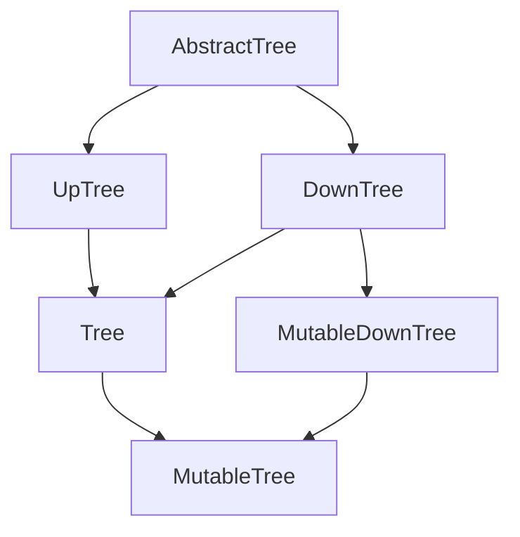
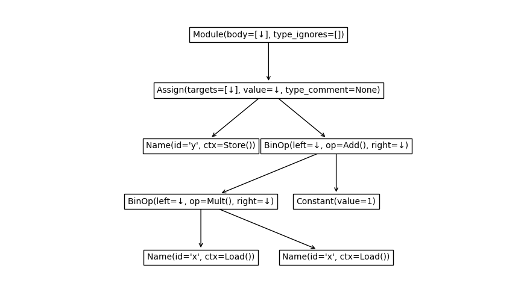

This Python package contains a few abstract base classes for tree data structures.
Trees are very common data structure that represents a hierarchy of common nodes.
This package defines abstract base classes for these data structure in order to make code reusable.

## Abstract base classes ##

```python
from abstracttree import to_mermaid

to_mermaid(AbstractTree)
```



Downtrees are trees that have links to their direct children.
Uptrees are trees that link to their parent.
A Tree has links in both directions.

| ABC               | Inherits from             | Abstract Methods                | Mixin Methods                                                        |
|-------------------|---------------------------|---------------------------------|----------------------------------------------------------------------|
| `AbstractTree`    |                           |                                 | `nid`, `eqv()`                                                                      |
| `UpTree`          | `AbstractTree`            | `parent`                        | `root`, `is_root`, `ancestors`, `path`                               |
| `DownTree`        | `AbstractTree`            | `children`                      | `nodes`, `descendants`, `leaves`, `levels`, `is_leaf`, `transform()` |
| `Tree`            | `UpTree`, `DownTree`      |                                 | `siblings`                                                           |
| `MutableDownTree` | `DownTree`                | `add_child()`, `remove_child()` | `add_children()`                                                     |
| `MutableTree`     | `Tree`, `MutableDownTree` |                                 | `detach()`                                                           |

In your own code, you can inherit from these trees.
For example, if your tree only has links to children:

```python
import abstracttree
from abstracttree import print_tree

class MyTree(abstracttree.DownTree):
    def __init__(self, value, children=()):
        self.value = value
        self._children = children
    
    def __str__(self):
        return "MyTree " + str(self.value)

    @property
    def children(self):
        return self._children

tree = MyTree(1, children=[MyTree(2), MyTree(3)])
print_tree(tree)

# This generates the following output:
# MyTree 1
# ├─ MyTree 2
# └─ MyTree 3
```

## Adapter ##

In practice, not all existing tree data structures implement one of these abstract classes.
As a bridge, you can use `astree` to convert these trees to a `Tree` instance.
However, whenever possible, it's recommended to inherit from `Tree` directly for minimal overhead.

Examples:

```python
# Trees from built-ins and standard library
astree(int)
astree(ast.parse("1 + 1 == 2"))
astree(pathlib.Path("abstracttree"))

# Anything that has parent and children attributes (anytree / bigtree / littletree)
astree(anytree.Node())

# Nested list
astree([[1, 2, 3], [4, 5, 6]])

# Tree from json-data
data = {"name": "a",
        "children": [
            {"name": "b", "children": []},
            {"name": "c", "children": []}
]}
astree(data, children=operator.itemgetter["children"])

# pyqt.QtWidget
astree(widget, children=lambda w: w.children(), parent = lambda w: w.parent())

# Tree from treelib
astree(tree.root, children=lambda nid: tree.children(nid), parent=lambda nid: tree.parent(nid))

# itertree
astree(tree, children=iter, parent=lambda t: t.parent)

# Infinite binary tree
inf_binary = astree(0, children=lambda n: (2*n + 1, 2*n + 2))
```

## Utility functions

Pretty printing
```python
tree = astree(seq, children=lambda x: [x[:-2], x[1:]] if x else [])
print_tree(tree)
print(to_string(tree))

# ['a', 'b', 'c', 'd']
# ├─ ['a', 'b']
# │  └─ ['b']
# └─ ['b', 'c', 'd']
#    ├─ ['b']
#    └─ ['c', 'd']
#       └─ ['d']
```

Plotting with matplotlib
```python
import matplotlib.pyplot as plt

expr = ast.parse("y = x*x + 1")
plot_tree(expr)
plt.show()
```


Export to various formats
```python
to_dot(tree)
to_mermaid(tree)
to_latex(tree)

to_image(Path('.'), "filetree.png", how="dot")
to_image(AbstractTree, "class_hierarchy.svg", how="mermaid")
to_pillow(tree).show()
```

## A few concrete tree implementations

- [anytree](https://github.com/c0fec0de/anytree)
- [treelib](https://github.com/caesar0301/treelib)
- [bigtree](https://github.com/kayjan/bigtree)
- [itertree](https://github.com/BR1py/itertree)
- [dendropy](https://github.com/jeetsukumaran/DendroPy)
- [ete](https://github.com/etetoolkit/ete)
- [littletree](https://github.com/lverweijen/littletree) - also by me

## Tree visualisation

- [PrettyPrintTree](https://github.com/AharonSambol/PrettyPrintTree) - colored terminal output
