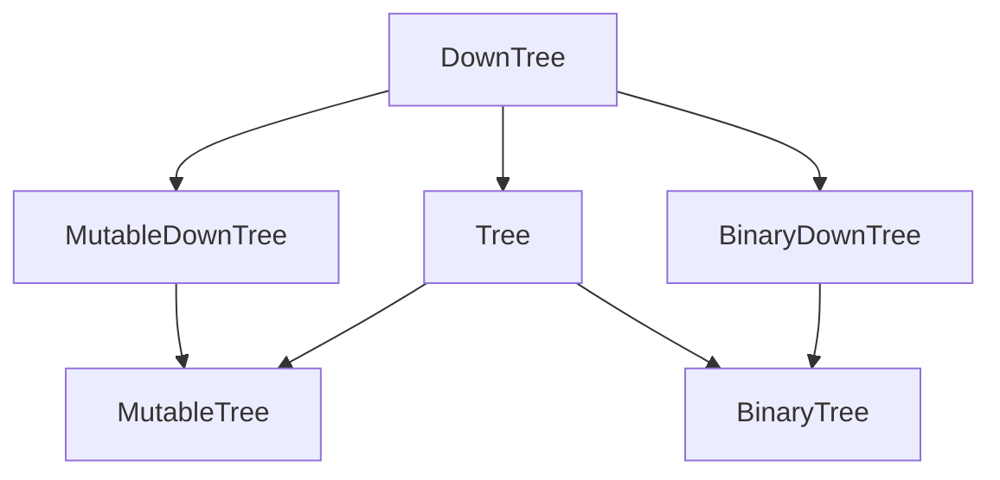

Trees are a common data structure and there are many different ways to implement them.
This package provides a common interface to access and operate on these objects.

## Installing ##
 
Use [pip](https://pip.pypa.io/en/stable/getting-started/) to install abstracttree:

```sh
$ pip install --upgrade abstracttree
```

## Usage ##

You can start by implementing the mixins below. Otherwise, a lot of trees are supported out of the box.

### Mixins ###



| ABC               | Inherits from             | Abstract Methods                | Mixin Methods                                                                                                                                                  |
|-------------------|---------------------------|---------------------------------|----------------------------------------------------------------------------------------------------------------------------------------------------------------|
| `DownTree`        |                           | `children`                      | `nodes`, `nodes.preorder()`, `nodes.postorder()`, `nodes.levelorder()`, `descendants`, `leaves`, `levels`, `levels.zigzag()`, `is_leaf`, `transform()`,  `nid` |
| `Tree`            | `DownTree`                | `parent`                        | `root`, `is_root`, `ancestors`, `path`, `siblings`                                                                                                             |
| `MutableDownTree` | `DownTree`                | `add_child()`, `remove_child()` | `add_children()`                                                                                                                                               |
| `MutableTree`     | `MutableDownTree`, `Tree` |                                 | `detach()`                                                                                                                                                     |
| `BinaryDownTree`  | `DownTree`                | `left_child`, `right_child`     | `children`, `nodes.inorder()`, `descendants.inorder()`                                                                                                         |
| `BinaryTree`      | `BinaryDownTree`, `Tree`  |                                 |                                                                                                                                                                |

For example, to create a simple tree with children (but no parent):

```python
from abstracttree import DownTree, print_tree

class MyTree(DownTree):
    def __init__(self, value, children=()):
        self.value = value
        self._children = children
    
    def __str__(self):
        return "MyTree " + str(self.value)

    @property
    def children(self):
        return self._children

tree = MyTree(1, children=[MyTree(2), MyTree(3)])
print_tree(tree)

# This generates the following output:
# MyTree 1
# ├─ MyTree 2
# └─ MyTree 3
```

### Generics ##

Unfortunately, not all trees inherit from the mixins above. Yet, some objects still have treelike behaviour.
Therefore, AbstractTree provides support for a slightly weaker protocol.

The following objects are `TreeLike`:
- All objects that support `obj.children` and `obj.parent`.
- Builtins classes `pathlib.Path` and `zipfile.Path`.
- Third party tree classes from [anytree](https://github.com/c0fec0de/anytree), [bigtree](https://github.com/kayjan/bigtree), [itertree](https://github.com/BR1py/itertree) and [littletree](https://github.com/lverweijen/littletree).

The following objects are `DownTreeLike`:
- All objects that support `obj.children`.
- Anything implementing `DownTree`.
- Recursive collections like lists, tuples, sets, dicts. This can be useful when dealing with json-data.

This can be tested using `isinstance`:

```python
isinstance(Path(r"C:\\Windows\System"), TreeLike)  # True
isinstance(range(100), DownTreeLike)  # True
isinstance(range(100), TreeLike)  # False
isinstance(5, DownTreeLike)  # False
isinstance("some text", DownTreeLike)  # False (even though it might be considered a collection by python).
```

### Basic functions

On downtreelikes:
```python
children(node)  # Children of node
label(node)  # String representation of node (similar to str, but output excludes parent and children)
nid(node)  # Address of node (similar to id, but supports delegates).
eqv(node1, node2)  # Check if 2 nodes have the same identity (similar to is, but supports delegates)
```

Additionally, on treelikes:
```python
parent(node)  # Parent of node or None if node is root of its own tree.
root(node)  # Find root of this tree.
```

Examples:
```python
>>> from abstracttree import *
>>> children([1, 2, 3])
[1, 2, 3]
>>> children({"name": "Philip", "children": ["Pete", "Mariam"]})
[MappingItem(key="name", value="Philip"), MappingItem(key="children", value=["Pete", "Miriam"])]
>>> parent(Path(r"C:\\Windows\System"))
Path(r"C:\\Windows")
>>> label(Path(r"C:\\Windows\System"))
"System"
>>> eqv(Path(r"C:\\Windows\System"), Path(r"C:\\Windows\System"))
True
>>> eqv([1, 2, 3], [1, 2, 3])
False
```

### Iterators

On downtreelikes:
```python
nodes(tree)  # Iterate through all nodes in tree (in no particular order).
descendants(node)  # Children and grand-(grand-*)-children of node.
leaves(root)  # Leaves reachable from root
```

If you want to iterate though the nodes in a specific order, use:
```python
preorder(node)  # Nodes in preorder (root comes first).
postorder(node)  # Nodes in postorder (root comes last).
levelorder(node)  # Nodes near the root come before later nodes.
```
These will return tuples with (node, item). The item-object contains information about the depth of the node.

Additionally, on treelikes:
```python
ancestors(node)  # Ancestors of node.
path(node)  # Path from root to this node including this node.
siblings(node)  # Siblings of node
```

### Adapters ###

To upgrade a `TreeLike` to a full `Tree` use `as_tree`.

```python
path_tree = as_tree(pathlib.Path("my_documents"))  # Optionally pass `children`, `parent`, `label`.

# Iterate over all its descendants
for node in path_tree.descendants:
    path_obj = node.value  # Get back a Path-object from TreeAdapter
```

There is also `TreeAdapter` to help with classes that are very different.

### Exporting ###

Export to various formats
```python
print_tree(tree)

# If matplotlib is installed
plot_tree(tree)

# These may require graphviz or Pillow to be installed.
to_dot(tree)
to_mermaid(tree)
to_latex(tree)
to_reportlab(tree)

to_image(Path('.'), "filetree.png", how="dot")
to_image(DownTree, "tree_hierarchy.svg", how="mermaid")
to_pillow(tree).show()
```
