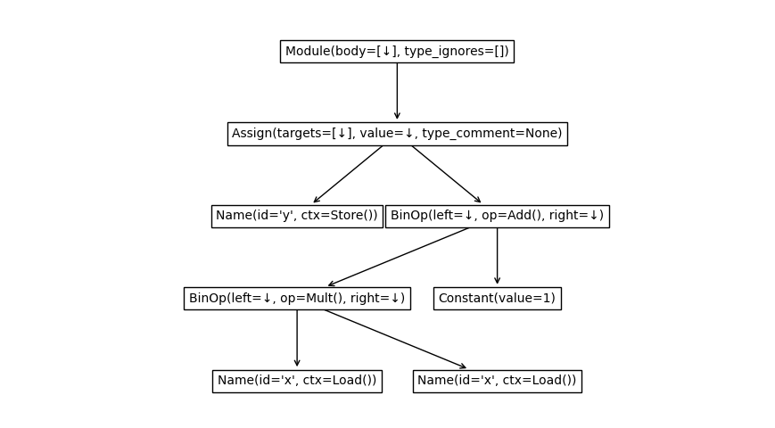
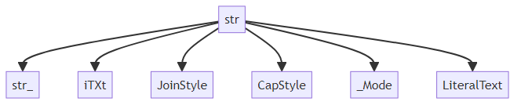

Usage
==================

Abstract tree classes
---------------------

.. mermaid::

    graph TD;
    Tree[Tree];
    MutableTree[MutableTree];
    DownTree[DownTree];
    Tree[Tree];
    MutableTree[MutableTree];
    MutableDownTree[MutableDownTree];
    MutableTree[MutableTree];
    BinaryDownTree[BinaryDownTree];
    BinaryTree[BinaryTree];
    Tree-->MutableTree;
    DownTree-->Tree;
    DownTree-->MutableDownTree;
    MutableDownTree-->MutableTree;
    DownTree-->BinaryDownTree;
    BinaryDownTree-->BinaryTree;
    Tree-->BinaryTree;

A downtree is an object that has links to its direct children.
A tree is similar to a downtree, but also has a link to its parent.
A binary tree may have at most two children.
A mutable tree can change its structure once created.

+---------------------+-------------------------------+-------------------------------------+------------------------------------------------------------------------------------+
| ABC                 | Inherits from                 | Abstract Methods                    | Mixin Methods                                                                      |
+=====================+===============================+=====================================+====================================================================================+
| ``AbstractTree``    |                               |                                     | ``nid``                                                                            |
+---------------------+-------------------------------+-------------------------------------+------------------------------------------------------------------------------------+
| ``DownTree``        | ``AbstractTree``              | ``children``                        | ``nodes``, ``descendants``, ``leaves``, ``levels``, ``is_leaf``, ``transform()``   |
+---------------------+-------------------------------+-------------------------------------+------------------------------------------------------------------------------------+
| ``Tree``            | ``DownTree``                  | ``parent``                          | ``ancestors``, ``siblings``, ``path``                                              |
+---------------------+-------------------------------+-------------------------------------+------------------------------------------------------------------------------------+
| ``MutableDownTree`` | ``DownTree``                  | ``add_child()``, ``remove_child()`` | ``add_children()``                                                                 |
+---------------------+-------------------------------+-------------------------------------+------------------------------------------------------------------------------------+
| ``MutableTree``     | ``MutableDownTree``, ``Tree`` |                                     | ``detach()``                                                                       |
+---------------------+-------------------------------+-------------------------------------+------------------------------------------------------------------------------------+
| ``BinaryDownTree``  | ``DownTree``                  | ``left_child``, ``right_child``     | ``children``                                                                       |
+---------------------+-------------------------------+-------------------------------------+------------------------------------------------------------------------------------+
| ``BinaryTree``      | ``BinaryDownTree``, ``Tree``  |                                     |                                                                                    |
+---------------------+-------------------------------+-------------------------------------+------------------------------------------------------------------------------------+

In your own code, you can inherit from these trees.
For example, if your tree only has links to children::

    from abstracttree import DownTree, print_tree

    class MyTree(DownTree):
        def __init__(self, value, children=()):
            self.value = value
            self._children = children

        def __str__(self):
            return "MyTree " + str(self.value)

        @property
        def children(self):
            return self._children

You can now use this class in the following way to generate output::

    tree = MyTree(1, children=[MyTree(2), MyTree(3)])
    print_tree(tree)

    # MyTree 1
    # ├─ MyTree 2
    # └─ MyTree 3

Generics
---------------------

Unfortunately, not all trees inherit from the mixins above. Yet, some objects still have treelike behaviour.
Therefore, AbstractTree provides support for a slightly weaker protocol.

The following objects are ``TreeLike``:

- All objects that support ``obj.children`` and ``obj.parent``.
- Builtins classes ``pathlib.Path`` and ``zipfile.Path``.
- Third party tree classes from `anytree <https://github.com/c0fec0de/anytree>`_, `bigtree <https://github.com/kayjan/bigtree>`_, `itertree <https://github.com/BR1py/itertree>`_ and `littletree <https://github.com/lverweijen/littletree>`_.

The following objects are ``DownTreeLike``:

- All objects that support ``obj.children``.
- Recursive collections like lists, tuples, sets, dicts. This can be useful when dealing with json-data.

This can be tested using `isinstance`::

    isinstance(Path(r"C:\\Windows\System"), TreeLike)  # True
    isinstance(range(100), DownTreeLike)  # True
    isinstance(range(100), TreeLike)  # False
    isinstance(5, DownTreeLike)  # False
    isinstance("some text", DownTreeLike)  # False (even though it might be considered a collection by python).

Basic functions
---------------

On downtreelikes::

    children(node)  # Children of node
    label(node)  # String representation of node (similar to str, but output excludes parent and children)
    nid(node)  # Address of node (similar to id, but supports delegates).
    eqv(node1, node2)  # Check if 2 nodes have the same identity (similar to is, but supports delegates)

Additionally, on treelikes::

    parent(node)  # Parent of node or None if node is root of its own tree.
    root(node)  # Find root of this tree.

Examples::

    >>> from abstracttree import *
    >>> children([1, 2, 3])
    [1, 2, 3]
    >>> children({"name": "Philip", "children": ["Pete", "Mariam"]})
    [MappingItem(key="name", value="Philip"), MappingItem(key="children", value=["Pete", "Miriam"])]
    >>> parent(Path(r"C:\\Windows\System"))
    Path(r"C:\\Windows")
    >>> label(Path(r"C:\\Windows\System"))
    "System"
    >>> eqv(Path(r"C:\\Windows\System"), Path(r"C:\\Windows\System"))
    True
    >>> eqv([1, 2, 3], [1, 2, 3])
    False

Iterators
---------

The following methods can iterate through nodes::

    nodes(tree)  # Iterate through all nodes in tree (in no particular order).
    descendants(node)  # Children and grand-(grand-*)-children of node.
    leaves(root)  # Leaves reachable from root
    ancestors(node)  # Ancestors of node.
    path(node)  # Path from root to this node including this node.
    siblings(node)  # Siblings of node

Traversal
~~~~~~~~~

The following methods also iterate, but in a very specific order.

Pre-order
    The parent is iterated over before its children.

Post-order
    The children are iterated over before their parent.

Level-order
    Nodes closer to root are iterated over before nodes further from the root.

All these are possible by writing one of::

    for node, item in preorder(tree):
        ...

    for node, item in postorder(tree):
        ...

    for node, item in levelorder(tree):
        ...

    # If Downtree is implemented, tree.nodes.preorder() also works.

These methods return an item in addition to a node.
This item is a tuple of the following fields:

depth
    This indicates how deep the node is relative to the root of the (sub)tree iterated over.
    The root of the (sub)tree always has depth 0.
    To find the absolute depth of a node, use ``node.ancestors.count()``.

index
    The index of this node among its siblings in relation to its direct parent.
    The first child of a parent gets index 0, the second gets index 1.
    The root of the (sub)tree always gets an index of ``0`` even if it has prior siblings.

To iterate over the descendants without the root, use the following::

    for descendant, item in preorder(tree, include_root=False):
        ...
    # If Downtree is implemented, tree.descendants.preorder() also works.

If the order of iteration doesn't matter an alternative way to iterate is as follows::

    for node in nodes(tree):
        ...

    for descendant in descendants(tree):
        ...

Adapters
------------------

If you want a ``Tree``-object, you can use ``as_tree`` to convert these treelikes to a full ``Tree``.
Alternatively, you can explicitly specify how to find ``children`` and ``parent``::

    # Tree from json-data
    data = {"name": "a",
            "children": [
                {"name": "b", "children": []},
                {"name": "c", "children": []}
    ]}
    as_tree(data, children=operator.itemgetter["children"])

    # pyqt.QtWidget
    as_tree(widget, children=lambda w: w.children(), parent = lambda w: w.parent())

    # Tree from treelib
    as_tree(tree.root, children=lambda nid: tree.children(nid), parent=lambda nid: tree.parent(nid))

    # itertree
    as_tree(tree, children=iter, parent=lambda t: t.parent)

    # Infinite binary tree
    inf_binary = as_tree(0, children=lambda n: (2*n + 1, 2*n + 2))

Export
----------------------------------------

Pretty printing::

    print_tree(Path())

    # ├─ adapters
    # │  ├─ adapters.py
    # │  ├─ heaptree.py
    # │  └─ __init__.py
    # ├─ export.py
    # ├─ generics.py
    # ├─ iterators.py
    # ├─ mixins
    # │  ├─ trees.py
    # │  ├─ views.py
    # │  └─ __init__.py
    # ├─ predicates.py
    # ├─ route.py
    # ├─ utils.py
    # └─ __init__.py

Plotting with matplotlib::

    import matplotlib.pyplot as plt

    plot_tree(ast.parse("y = x*x + 1"))
    plt.show()

Export to graphviz::

    tree = as_tree(seq, children=lambda x: [x[:-2], x[1:]] if x else [])
    to_graphviz(tree)

.. image:: images/tree_dot.png

Export to mermaid::

    to_mermaid(str)

Export to latex::

    data = [["james", "steve"],
            ["patrick", "mike", "bod", "piet"]]
    to_latex(data)

.. image:: images/latex_img.png
