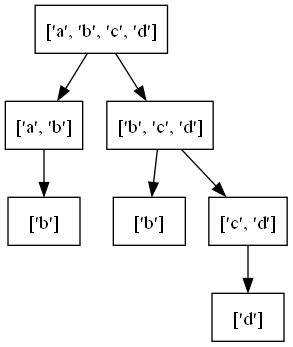
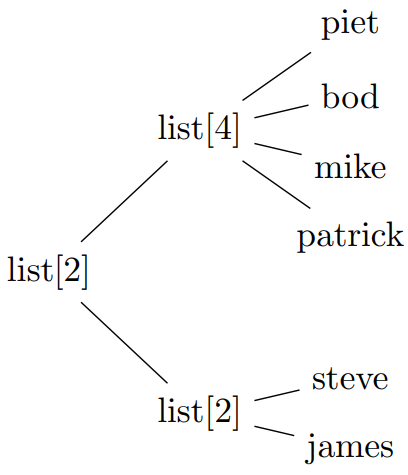

Usage
==================

Abstract tree classes
---------------------

.. image:: images/abstracttree.png

Downtrees are trees that have links to their direct children.
Uptrees are trees that link to their parent.
A Tree has links in both directions.

+---------------------+-------------------------------+-------------------------------------+------------------------------------------------------------------------------------+
| ABC                 | Inherits from                 | Abstract Methods                    | Mixin Methods                                                                      |
+=====================+===============================+=====================================+====================================================================================+
| ``AbstractTree``    |                               |                                     | ``nid``, ``eqv()``                                                                 |
+---------------------+-------------------------------+-------------------------------------+------------------------------------------------------------------------------------+
| ``UpTree``          | ``AbstractTree``              | ``parent``                          | ``root``, ``is_root``, ``ancestors``, ``path``                                     |
+---------------------+-------------------------------+-------------------------------------+------------------------------------------------------------------------------------+
| ``DownTree``        | ``AbstractTree``              | ``children``                        | ``nodes``, ``descendants``, ``leaves``, ``levels``, ``is_leaf``, ``transform()``   |
+---------------------+-------------------------------+-------------------------------------+------------------------------------------------------------------------------------+
| ``Tree``            | ``UpTree``, ``DownTree``      |                                     | ``siblings``                                                                       |
+---------------------+-------------------------------+-------------------------------------+------------------------------------------------------------------------------------+
| ``MutableDownTree`` | ``DownTree``                  | ``add_child()``, ``remove_child()`` | ``add_children()``                                                                 |
+---------------------+-------------------------------+-------------------------------------+------------------------------------------------------------------------------------+
| ``MutableTree``     | ``Tree``, ``MutableDownTree`` |                                     | ``detach()``                                                                       |
+---------------------+-------------------------------+-------------------------------------+------------------------------------------------------------------------------------+
| ``BinaryDownTree``  | ``DownTree``                  | ``left_child``, ``right_child``     | ``children``                                                                       |
+---------------------+-------------------------------+-------------------------------------+------------------------------------------------------------------------------------+
| ``BinaryTree``      | ``BinaryDownTree``, ``Tree``  |                                     |                                                                                    |
+---------------------+-------------------------------+-------------------------------------+------------------------------------------------------------------------------------+

In your own code, you can inherit from these trees.
For example, if your tree only has links to children::

    import abstracttree
    from abstracttree import print_tree

    class MyTree(abstracttree.DownTree):
        def __init__(self, value, children=()):
            self.value = value
            self._children = children

        def __str__(self):
            return "MyTree " + str(self.value)

        @property
        def children(self):
            return self._children

You can now use this class in the following way to generate output::

    tree = MyTree(1, children=[MyTree(2), MyTree(3)])
    print_tree(tree)

    # MyTree 1
    # ├─ MyTree 2
    # └─ MyTree 3

Adapter
------------------

In practice, not all existing tree data structures implement one of the abstract classes specified in `Abstract classes <treeclasses.html>`_.
As a bridge, you can use ``Tree.convert`` to convert these trees to a ``Tree`` instance.
However, whenever possible, it's recommended to inherit from ``Tree`` directly for minimal overhead.

``Tree.convert`` already does the right thing on many objects of the standard library::

    # Inheritance hierarchy
    Tree.convert(int)

    # Abstract syntax tree
    Tree.convert(ast.parse("1 + 1 == 2"))

    # Filesystem
    Tree.convert(pathlib.Path("abstracttree"))

    # Zipfile
    Tree.convert(zipfile.ZipFile("eclipse.jar"))

    # Nested list
    Tree.convert([[1, 2, 3], [4, 5, 6]])

It can also construct a tree by ducktyping on ``parent`` and ``children`` attributes::

    # Works on objects by anytree, bigtree and littletree
    Tree.convert(anytree.Node('node'))

Alternatively, you can use ``astree`` and explicitly specify how to find ``children`` and ``parent``::

    # Tree from json-data
    data = {"name": "a",
            "children": [
                {"name": "b", "children": []},
                {"name": "c", "children": []}
    ]}
    astree(data, children=operator.itemgetter["children"])

    # pyqt.QtWidget
    astree(widget, children=lambda w: w.children(), parent = lambda w: w.parent())

    # Tree from treelib
    astree(tree.root, children=lambda nid: tree.children(nid), parent=lambda nid: tree.parent(nid))

    # itertree
    astree(tree, children=iter, parent=lambda t: t.parent)

    # Infinite binary tree
    inf_binary = astree(0, children=lambda n: (2*n + 1, 2*n + 2))

Traversal
----------------------------------------

There are 3 common ways to traverse a tree:

Pre-order
    The parent is iterated over before its children.

Post-order
    The children are iterated over before their parent.

Post-order
    Nodes closer to root are iterated over before nodes further from the root.

All these are possible by writing one of::

    for node, item in tree.nodes.preorder():
        ...

    for node, item in tree.nodes.postorder():
        ...

    for node, item in tree.nodes.levelorder():
        ...

These methods return an item in addition to a node.
This item is a tuple of the following fields:

depth
    This indicates how deep the node is relative to the root of the (sub)tree iterated over.
    The root of the (sub)tree always has depth 0.
    To find the absolute depth of a node, use ``node.ancestors.count()``.

index
    The index of this node among its siblings in relation to its direct parent.
    The first child of a parent gets index 0, the second gets index 1.
    The root of the (sub)tree always gets an index of ``0`` even if it has prior siblings.

To iterate over the descendants (the nodes without the root), similar methods are defined::

    for descendant, item in tree.descendants.preorder():
        ...

If the order of iteration doesn't matter an alternative way to iterate is as follows::

    for node in tree.nodes:
        ...

    for descendant in tree.descendants:
        ...

Export
----------------------------------------

Pretty printing::

    print_tree(Path())
    # .
    # ├─ abstracttree
    # │  ├─ abstracttree\conversions.py
    # │  ├─ abstracttree\export.py
    # │  ├─ abstracttree\predicates.py
    # │  ├─ abstracttree\treeclasses.py
    # │  └─ abstracttree\__init__.py
    # ├─ LICENSE
    # ├─ Makefile
    # ├─ manual.txt
    # ├─ pyproject.toml
    # ├─ README.md
    # └─ tests
    #    ├─ tests\test_downtree.py
    #    ├─ tests\test_export.py
    #    ├─ tests\test_mutabletree.py
    #    ├─ tests\test_tree.py
    #    ├─ tests\test_uptree.py
    #    └─ tests\tree_instances.py

Plotting with matplotlib::

    import matplotlib.pyplot as plt

    plot_tree(ast.parse("y = x*x + 1"))
    plt.show()

.. image:: images/tree_calc_plot.png

Export to graphviz::

    tree = astree(seq, children=lambda x: [x[:-2], x[1:]] if x else [])
    to_graphviz(tree)

Export to mermaid::

    to_mermaid(str)

.. image:: images/str_mermaid.png

Export to latex::

    data = [["james", "steve"],
            ["patrick", "mike", "bod", "piet"]]
    to_latex(data)

